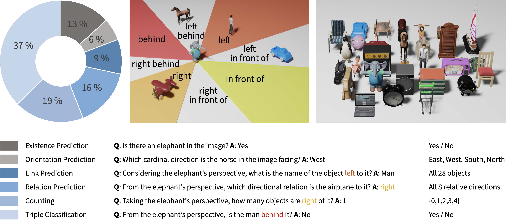

What is Right for Me is Not Yet Right for You:<br>A Dataset for Grounding Relative Directions via Multi-Task Learning
========

<!-- [Paper](https://arxiv.org/abs/2205.02671) • [Video](toBeInserted) • [BibTex](toBeInserted) • [Dataset Download](https://www2.informatik.uni-hamburg.de/wtm/datasets2/grid-3d.zip) -->
[Paper](https://arxiv.org/abs/2205.02671) • [Dataset Download](https://www2.informatik.uni-hamburg.de/wtm/datasets2/grid-3d.zip)

This is the official repository associated with our [IJCAI-ECAI 2022](https://ijcai-22.org) paper, in which we present our novel VQA GRiD-3D (<u>**G**</u>rounding <u>**R**</u>elat<u>**i**</u>ve <u>**D**</u>irections in <u>**3D**</u>) dataset. The code was tested with python version 3.9 on Ubuntu 20.04.

The experiments in our paper were conducted with the original versions of the MAC and FiLM models, which will be included as submodules in this repository.

## Environment Setup

First, clone the repository locally:
```
git clone https://github.com/knowledgetechnologyuhh/grid-3d.git
```
Then go to the root of the folder and install all necessary Python packages, conveniently using [Anaconda](https://docs.conda.io/en/latest/):
```
conda env create -f environment.yml
conda activate grid3d_env
```
or manually by instally the following packages:
```
ipdb 
munch
python=3.9 
torch 
pytorch-lightning=1.5.10 
termcolor 
torchmetrics 
torchvision 
yacs 
```
Now, download the submodules for the VQA models FiLM and MAC and install the `grid3d` package and the `vr` package (used by the FiLM model):
```
git submodule update --init --recursive
python -m pip install -e .
cd grid3d/models/film
git checkout lee/optimize
python -m pip install -e .
cd ../..
```

Next step is to download and extract the dataset, which we explain in the following section.

## GRiD-3D Dataset



You can download the dataset by clicking [here](https://www2.informatik.uni-hamburg.de/wtm/datasets2/grid-3d.zip) or by running the following commands in your terminal:

### Ubuntu / Linux:
```
wget https://www2.informatik.uni-hamburg.de/wtm/datasets2/grid-3d.zip
```

### OS X:

```
curl -O https://www2.informatik.uni-hamburg.de/wtm/datasets2/grid-3d.zip
unzip grid-3d.zip && rm grid-3d.zip
```

The default path for the dataset is set to `/data/grid3d/`, but you can change the path by modifying the corresponding entry in the `train_mac.py` and `train_film.py`:
```
cfg.DATASET.PATH = "path/to/the/dataset/folder"
```
## Running an Experiment
Run
`python grid3d/train_film.py` or `python grid3d/train_mac.py` to the replicate the experiments on the GRiD-3D dataset with all six tasks.
To run experiments on selected tasks, set the size of the corresponding task in `train_film.py` or `train_mac.py` to 0, e.g, to omit the **Link Prediction** task: 
```
cfg.TASK_SIZES.existence_prediction = 59053
cfg.TASK_SIZES.orientation_prediction = 26344
cfg.TASK_SIZES.link_prediction = 0 # 40770
cfg.TASK_SIZES.relation_prediction = 69800
cfg.TASK_SIZES.counting = 92904
cfg.TASK_SIZES.triple_classification = 166603
```


### ...Want some more? Here is another VQA dataset for grounding relative directions in 3D with abstract objects:

---
# Knowing Earlier what Right Means to You: A Comprehensive VQA Dataset for Grounding Relative Directions via Multi-Task Learning
[Paper](https://arxiv.org/abs/2207.02624) • [Dataset Download](ToBeInserted)

This is our novel GRiD-A-3D dataset accepted for the First International Workshop on Spatio-Temporal Reasoning and Learning ([STRL 2022](https://strl2022.github.io)) at [IJCAI](https://ijcai-22.org). 

## Environment Setup

You can set up your environment as described above, if you haven't done so yet. 

## GRiD-A-3D Dataset

Just click [here](ToBeInserted) to download the GRiD-A-3D dataset or run one of the following commands: 
### Ubuntu / Linux:
```
wget ToBeInserted
```

### OS X:

```
curl -O ToBeInserted
```

## Running an Experiment

Keep in mind to change the dataset path in the config file (the default is XXX):
```
cfg.DATASET.PATH = "path/to/the/dataset/folder"
```
If you have downloaded both GRiD-3D and GRiD-A-3D datasets, don't forget to adjust the path to the desired dataset every time you run a new experiment.

---


---

## Cite our Work

If you find our work on grounding relative directions useful, please cite our work:

```
@InProceedings{lee_grid3d_2022,
  author       = "Lee, Jae Hee and Kerzel, Matthias and Ahrens, Kyra and Weber, Cornelius and Wermter, Stefan",
  title        = "What is Right for Me is Not Yet Right for You: A Dataset for Grounding Relative Directions via Multi-Task Learning",
  booktitle    = "International Joint Conference on Artificial Intelligence",
  month        = "Jul",
  year         = "2022",
  url          = "https://arxiv.org/abs/2205.02671"
}
```
```
@InProceedings{ahrens_grida3d_2022,
  author       = "Ahrens, Kyra and Kerzel, Matthias and Lee, Jae Hee and Weber, Cornelius and Wermter, Stefan",
  title        = "Knowing Earlier what Right Means to You: A Comprehensive VQA Dataset for Grounding Relative Directions via Multi-Task Learning",
  booktitle    = "IJCAI Workshop on Spatio-Temporal Reasoning and Learning",
  month        = "Jul",
  year         = "2022",
  url          = "https://arxiv.org/abs/2207.02624"
}
```
