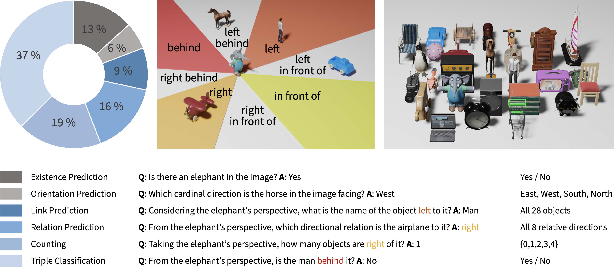

What is Right for Me is Not Yet Right for You:<br>A Dataset for Grounding Relative Directions via Multi-Task Learning
========

[Paper](https://www2.informatik.uni-hamburg.de/wtm/publications/2022/LKAWW22/GRID3D_IJCAI22.pdf) • [Video](toBeInserted) • [BibTex](toBeInserted) • [Dataset Download](toBeInserted)

This is the official repository associated with our [IJCAI-ECAI 2022](https://ijcai-22.org) paper, in which we present our novel VQA GRiD-3D (<u>**G**</u>rounding <u>**R**</u>elat<u>**i**</u>ve <u>**D**</u>irections in <u>**3D**</u>) dataset. The code was tested with python version X.X.X on macOS Monterey. 

If you find this work useful, please cite our [paper](https://www2alt.informatik.uni-hamburg.de/wtm/publications/2022/LKAWW22/index.php):

```
@InProceedings{lee_grid3d_2022,
  author       = "Lee, Jae Hee and Kerzel, Matthias and Ahrens, Kyra and Weber, Cornelius and Wermter, Stefan",
  title        = "What is Right for Me is Not Yet Right for You: A Dataset for Grounding Relative Directions via Multi-Task Learning",
  booktitle    = "International Joint Conference on Artificial Intelligence",
  year         = "2022",
  url          = "https://www2.informatik.uni-hamburg.de/wtm/publications/2022/LKAWW22/GRID3D_IJCAI22.pdf"
}
```

The experiments in our paper were conducted with the original versions of the MAC and FiLM models, which will be included as submodules in this repository.

## Environment Setup

First, clone the repository locally:

```
git clone https://github.com/knowledgetechnologyuhh/grid-3d.git
 ```

## GRiD-3D Dataset



You can download the dataset by clicking [here](toBeInserted) or by running the following commands in your terminal:

#### Ubuntu / Linux:
```
wget LinkToBeInserted
```

#### OS X:

```
curl -O LinkToBeInserted
```


